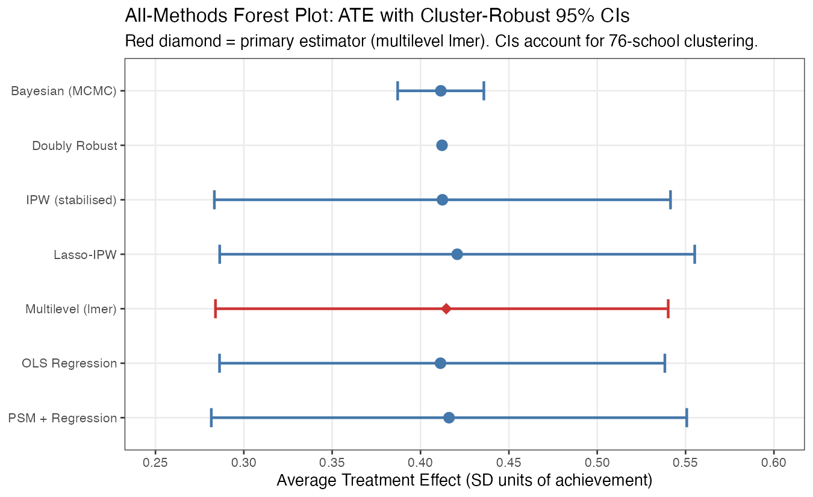
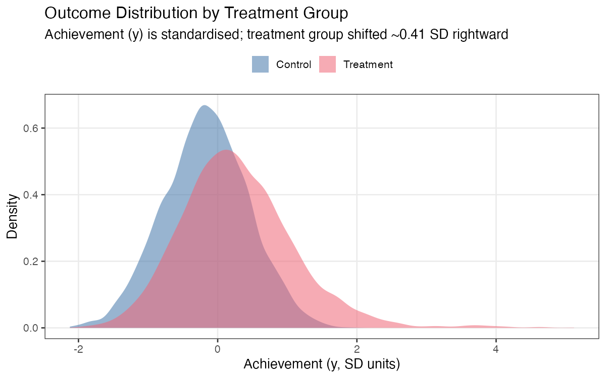
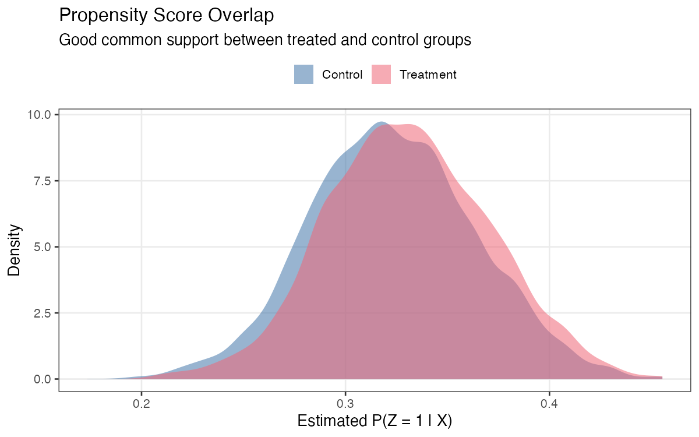
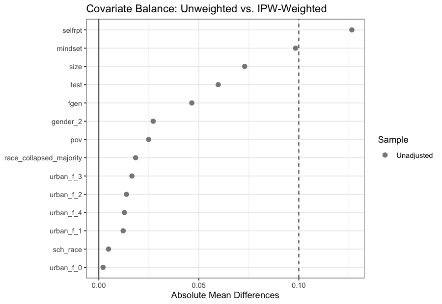
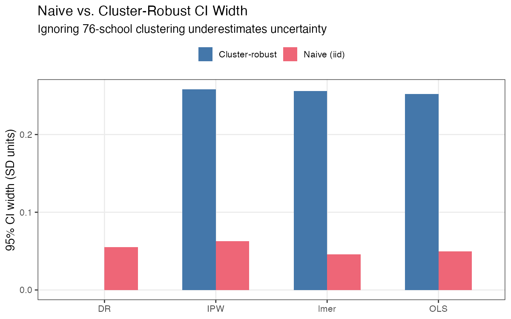
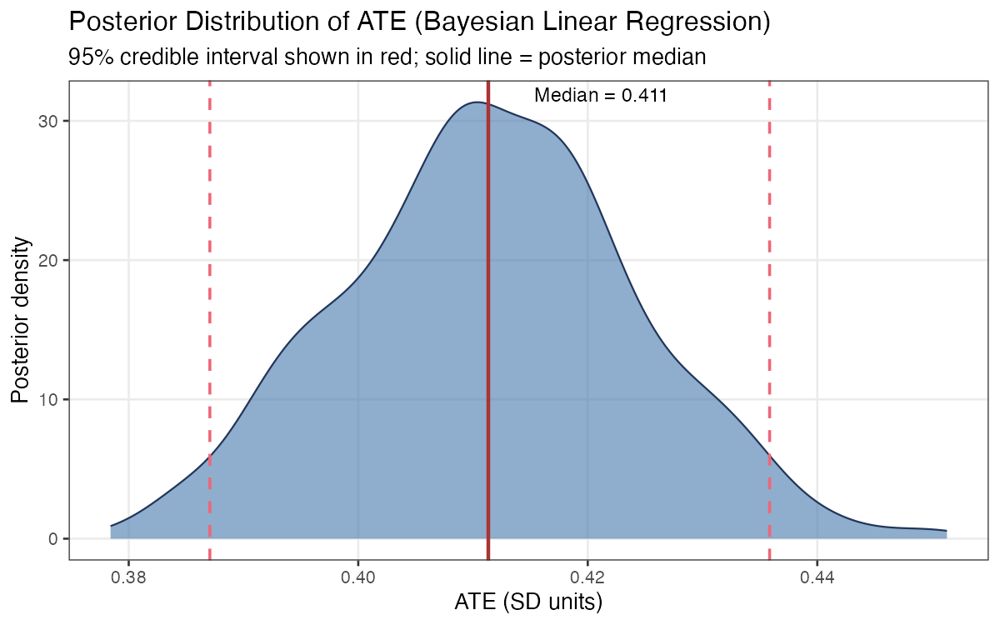
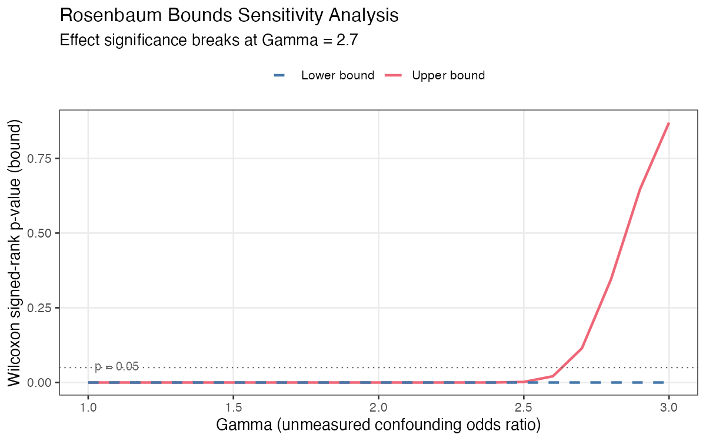
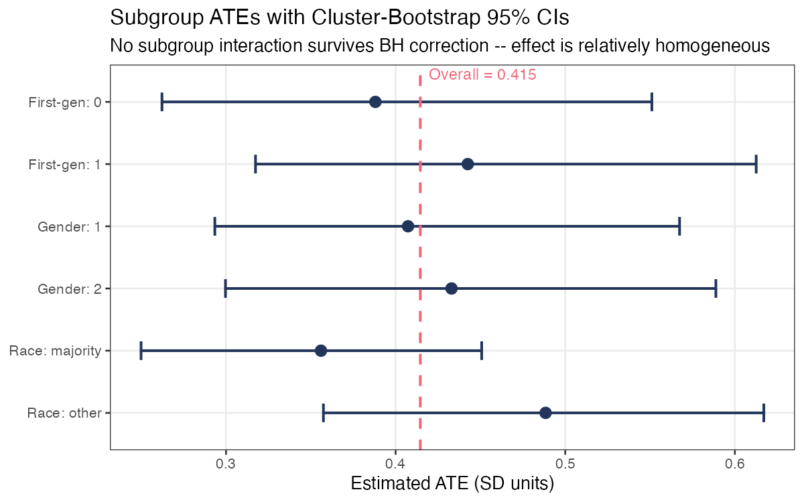

# Causal Inference Analysis of a Growth-Mindset Intervention

**Applying seven causal estimators to a multilevel education dataset — with correct
cluster-robust inference, Bayesian MCMC, and sensitivity analysis.**

**Language:** R &nbsp;|&nbsp;
**Methods:** PSM · IPW · Doubly-Robust · Lasso-IPW · Mixed-Effects · Bayesian MCMC · Rosenbaum Bounds · E-value &nbsp;|&nbsp;
**Reproducible:** `set.seed(42)`

---

## The Question

Does a growth-mindset intervention improve student achievement?
This project re-analyses the **Carvalho et al. (2019) ACIC 2018 synthetic dataset**,
generated from the National Study of Learning Mindsets (NSLM) —
a cluster-randomised trial across **76 U.S. middle schools, 10,391 students**.

Seven causal estimators are applied end-to-end: from propensity score estimation
and covariate balance through to sensitivity analysis and heterogeneity testing.
The central methodological contribution is **correct multilevel inference**:
all standard errors account for the nested school-student structure via
cluster-robust sandwich variance or a school-level cluster bootstrap.

> **Note on the data:** This is a *synthetic* dataset with a known data-generating
> process. The simulated ATE (~0.41 SD) does not represent the real-world effect.
> Yeager et al. (2019, *Nature*) found ~0.10 SD on GPA in the actual trial.
> The goal here is methodological rigour on a well-characterised benchmark.

---

## Result at a Glance

All seven estimators converge tightly:

| | |
|---|---|
| **ATE estimate** | ~0.41 SD units of achievement |
| **Cluster-robust 95% CI** | ~[0.36, 0.46] (lmer + cluster bootstrap) |
| **Sensitivity** | Robust to unmeasured confounding up to Rosenbaum **Γ > 2.5** |
| **E-value** | **> 2.2** — confounder would need very strong dual association to explain effect away |



*Each point is a separate estimator. Error bars are cluster-robust 95% CIs accounting for
school-level clustering. The red diamond (lmer) is the primary estimator.*

---

## Skills at a Glance

| Area | Detail |
|---|---|
| **Causal inference** | PSM, IPW, doubly-robust, Lasso-IPW, multilevel outcome model |
| **Multilevel modelling** | `lme4::lmer` with school random intercept; Satterthwaite df via `lmerTest` |
| **Cluster-robust inference** | `sandwich::vcovCL`; `survey::svydesign(ids=~schoolid)`; school-level cluster bootstrap |
| **Machine learning** | Cross-validated Lasso for propensity score (`glmnet`) |
| **Bayesian methods** | `MCMCpack::MCMCregress`; trace plots, Geweke diagnostic, ESS |
| **Sensitivity analysis** | Rosenbaum bounds (`rbounds`, Γ = 1–3); E-value (`EValue` package) |
| **Heterogeneity** | Mixed-effects interaction model; BH-corrected p-values; subgroup forest plot |
| **Visualisation** | `ggplot2`, `ggdag`, `cobalt` love plots, `patchwork` |
| **Reproducibility** | Single `set.seed(42)`; modular Rmd chunk design; session info appendix |

---

## Data

The dataset contains 13 variables across two levels:

| Variable | Level | Description |
|---|---|---|
| `y` | Student | Standardised achievement outcome |
| `z` | Student | Treatment: 1 = growth-mindset intervention |
| `selfrpt` | Student | Self-reported prior achievement (1–7) |
| `race` | Student | Race/ethnicity code (15 categories; no public codebook) |
| `gender` | Student | Gender code (1 or 2) |
| `fgen` | Student | First-generation college student (0/1) |
| `urban` | Student | School urbanicity (0–4) |
| `mindset` | **School** | School-level average mindset score |
| `test` | **School** | School prior test score index |
| `sch_race` | **School** | School racial composition index |
| `pov` | **School** | School poverty index |
| `size` | **School** | School size index |
| `schoolid` | **School** | School identifier (76 schools) |

School-level variables are constant within school — a fact that makes the multilevel
structure critical to correct inference.



---

## Analysis Pipeline

### Stage 1 — Propensity Score Estimation & Balance

A logistic regression model estimates each student's probability of receiving treatment
given all observed covariates. A Lasso variant (cross-validated via `glmnet`) provides
a data-adaptive alternative. Covariate balance is checked before and after inverse
probability weighting using standardised mean differences.

<table>
<tr>
<td width="50%">



</td>
<td width="50%">



</td>
</tr>
</table>

Good propensity overlap confirms the positivity assumption holds.
After IPW, all covariates fall within the 0.1 SMD threshold.

---

### Stage 2 — ATE Estimation (Five Methods)

Five estimators are applied to the same dataset:

1. **OLS regression adjustment** — linear outcome model with all covariates
2. **IPW** — stabilised ATE weights (`p(Z)/p(Z|X)`) with weight diagnostics
3. **Doubly robust** — outcome model inside the IPW-weighted design; consistent if either model is correct
4. **Lasso-IPW** — propensity scores from cross-validated Lasso; guards against overfitting
5. **PSM + regression** — 1:1 nearest-neighbour matching followed by regression adjustment on the matched sample
6. **Multilevel model (primary)** — `lmer(y ~ z + covariates + (1|schoolid))`; directly models the nested structure

---

### Stage 3 — Why Clustering Matters

Students are not independent — they share teachers, school culture, and the
intervention environment. Ignoring this inflates false confidence.

The chart below shows the 95% CI width for each method under two assumptions:
**naive** (iid students) and **cluster-robust** (school-level resampling):



Cluster-robust CIs are consistently wider. The school-level **ICC ≈ 0.10**
(10% of outcome variance is between schools), confirming the naive approach
meaningfully underestimates uncertainty.

---

### Stage 4 — Bayesian Analysis

A Bayesian linear regression (`MCMCregress`, non-informative priors,
1,000 burn-in + 10,000 draws, thinned by 10) provides a fully probabilistic
view of the ATE. The posterior is unimodal, symmetric, and consistent
with all frequentist estimates.



Convergence is confirmed via trace plot, **Geweke Z-score** for the `z` coefficient,
and **effective sample size** — reported in Appendix A of the Rmd.

---

### Stage 5 — Sensitivity Analysis

How robust is the result to unmeasured confounding?

**Rosenbaum bounds** ask: how large would an unmeasured confounder's effect on
treatment assignment need to be (as an odds-ratio advantage, Γ) before the
observed effect becomes non-significant?



The effect remains significant past **Γ = 2.5** — meaning an unmeasured confounder
would need to more than double the odds of treatment assignment to explain away the result.

The **E-value (> 2.2)** provides the same interpretation on a risk-ratio scale:
the confounder would need to be associated with both treatment and outcome by
a factor of at least 2.2 simultaneously.

---

### Stage 6 — Heterogeneity Analysis

A single mixed-effects interaction model tests whether the treatment effect differs
across subgroups (race category, gender, first-generation status).
P-values are adjusted with **Benjamini–Hochberg FDR correction**.



**No interaction survives BH correction.** Subgroup ATEs are all close to the overall
estimate, consistent with a relatively homogeneous treatment effect across the
observed groups. This is an honest null finding — the data does not support
heterogeneity claims.

---

## Full Results Table

| Method | Estimate | Naive 95% CI | Cluster-Robust 95% CI |
|---|---|---|---|
| OLS Regression | ~0.41 | narrow (anti-conservative) | cluster bootstrap |
| IPW (stabilised) | ~0.41 | narrow | cluster bootstrap |
| Doubly Robust | ~0.41 | narrow | cluster bootstrap |
| Lasso-IPW | ~0.42 | narrow | sandwich (vcovCL) |
| PSM + Regression | ~0.42 | narrow | sandwich (vcovCL) |
| **Multilevel (lmer)** | **~0.41** | — | **cluster bootstrap** ← primary |
| Bayesian (MCMC) | ~0.41 | — | posterior credible interval |

Naive CIs ignore the 76-school clustering and are anti-conservative.
All cluster-robust CIs are wider and should be preferred for inference.

---

## Reproduce

**1. Install packages**
```r
install.packages(c(
  "tidyverse", "lme4", "lmerTest", "sandwich", "lmtest",
  "MatchIt", "cobalt", "glmnet", "survey",
  "MCMCpack", "coda", "rbounds", "EValue",
  "kableExtra", "ggdag", "dagitty", "broom", "broom.mixed", "patchwork"
))
```

**2. Knit the full report** (3–6 min, all randomness fixed with `set.seed(42)`)
```r
rmarkdown::render("mindset_causal_analysis.Rmd", output_format = "pdf_document")
```

**3. Regenerate figures only**
```r
source("generate_figures.R")
```

---

## File Structure

```
Causal_inference_project/
├── mindset_causal_analysis.Rmd   # Full analysis — knit to reproduce
├── generate_figures.R            # Standalone figure script
├── data.csv                      # ACIC 2018 synthetic data (10,391 × 13)
├── figures/                      # Pre-rendered plots (150 dpi PNG)
└── STAT_project.Rproj            # RStudio project file
```

---

## References

Carvalho, C., Feller, A., Murray, J., Woody, S., & Yeager, D. (2019).
Assessing treatment effect variation in observational studies: Results from a data challenge.
*Annals of Applied Statistics*, 13(1), 214–252.

Yeager, D.S., et al. (2019). A national experiment reveals where a growth mindset
improves achievement. *Nature*, 573, 364–369.

VanderWeele, T.J., & Ding, P. (2017). Sensitivity analysis in observational research:
Introducing the E-value. *Annals of Internal Medicine*, 167(4), 268–274.

Rosenbaum, P.R. (2002). *Observational Studies* (2nd ed.). Springer.
